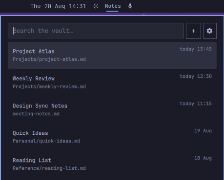

# Obsidian Notes for Omarchy

Search, open, and capture Obsidian notes without leaving the Omarchy bar.



## Highlights

- Search every Markdown note by title, path, or full text.
- See ranked results instantly, with matching-line previews when searching.
- Open a selected note through Obsidian's native `obsidian://` URI.
- Capture a quick Markdown note directly from the panel.
- Choose or change the vault with the built-in folder picker.
- Navigate entirely by keyboard or use the mouse.
- Match the active Omarchy theme, typography, and panel styling.
- Run locally with no network access, background service, or index database.

## Install

```sh
omarchy plugin add https://github.com/joisephdev/omarchy-obsidian --enable
```

The `Notes` widget is placed in the center section by default. Move it anywhere
in the bar with:

```sh
omarchy bar move rperaza.obsidian-notes --section right
```

## Choose a vault

1. Open `Notes` from the bar.
2. Select the settings icon.
3. Browse to the directory containing your Markdown notes.
4. Select **Use this folder**.

The selected path is stored in `~/.config/omarchy/shell.json` and survives
shell and system restarts. Any directory of Markdown files works; it does not
need to be open in Obsidian while searching.

You can also configure the path from a terminal:

```sh
omarchy bar set rperaza.obsidian-notes vaultPath ~/Documents/my-vault
```

Both absolute paths and paths beginning with `~/` are supported.

## Search and open notes

Open the panel and start typing. Results are ranked with title and path matches
first, followed by full-text matches. Search is case-insensitive and treats the
query as plain text rather than a regular expression.

- **Up / Down** — move through results
- **Enter** — open the selected note in Obsidian
- **Escape** — clear the query; press again to close the panel
- **Tab** — move to the next bar panel
- **Left click** — open or close the Notes panel
- **Right click** — open the vault root in Obsidian

Note titles are resolved in this order:

1. `title:` or `titulo:` in YAML frontmatter
2. The first Markdown heading
3. The Markdown filename

## Capture a quick note

Select **+** to replace the result list with a focused Markdown editor. Write
the note and select **Save**. The plugin creates the following directory when
needed:

```text
<vault>/omarchy-notes/
```

Notes use collision-safe timestamped filenames such as:

```text
omarchy-notes/2026-08-20-143015.md
```

Existing files are never overwritten. Select **Cancel** or press **Escape** to
return to search without writing a file.

## Privacy and filesystem access

Everything happens locally:

- `search.sh` reads Markdown files inside the selected vault.
- `create-note.sh` writes only to `<vault>/omarchy-notes/` when you explicitly
  save a quick note.
- `.obsidian/`, `.trash/`, and `.git/` directories are excluded from search.
- No note contents, filenames, or queries are sent over the network.
- No index, cache, telemetry, or background daemon is created.

Like all Omarchy shell plugins, this plugin runs with your user permissions.
Review the source before installing third-party plugins.

## Requirements

- Omarchy Quattro with the Quickshell-based shell
- Obsidian, for opening notes through `obsidian://`
- Standard tools already available on Omarchy: `bash`, `find`, `awk`, `sed`,
  `grep`, `stat`, and coreutils
- Optional: `rg` (ripgrep) for faster full-text matching

## Update

```sh
omarchy plugin update rperaza.obsidian-notes
```

## Remove

```sh
omarchy plugin remove rperaza.obsidian-notes
```

Removing the plugin does not delete or modify your vault. Notes previously
created under `omarchy-notes/` remain ordinary Markdown files.

## Troubleshooting

### The panel asks for a vault

Use the settings icon and select the vault directory, or set `vaultPath` with
the terminal command shown above.

### No notes appear

Confirm that the selected directory exists and contains `.md` files. Hidden
Obsidian metadata and trash directories are intentionally ignored.

### A note does not open

Confirm that Obsidian is installed and registered as the handler for
`obsidian://` links. Search continues to work even when Obsidian is closed.

### Changes do not appear after development edits

User plugins normally hot-reload. Force discovery when needed:

```sh
omarchy-shell shell rescanPlugins
```

## Development

Validate the plugin directory before publishing:

```sh
omarchy plugin validate .
bash -n search.sh create-note.sh
```

The plugin has no build step and no downloaded runtime dependencies.

## License

[MIT](LICENSE)
